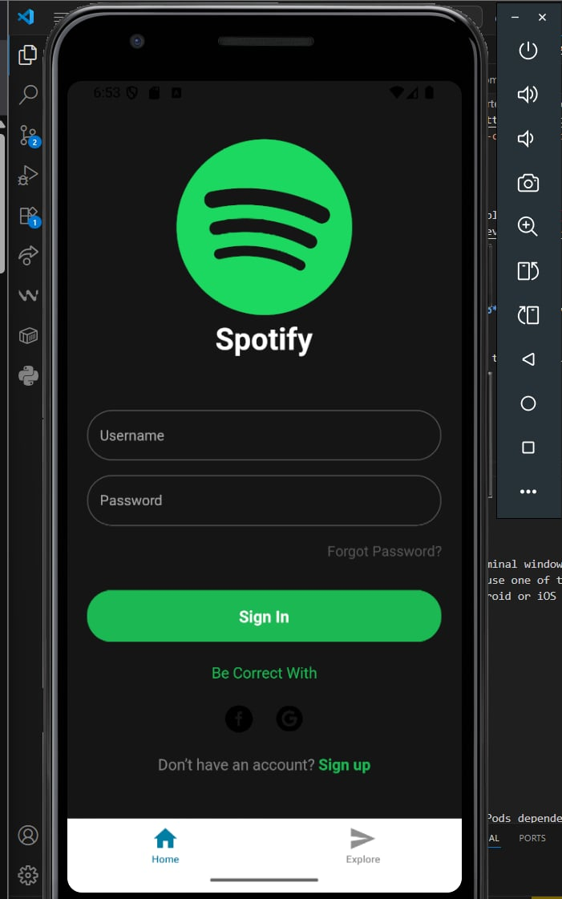
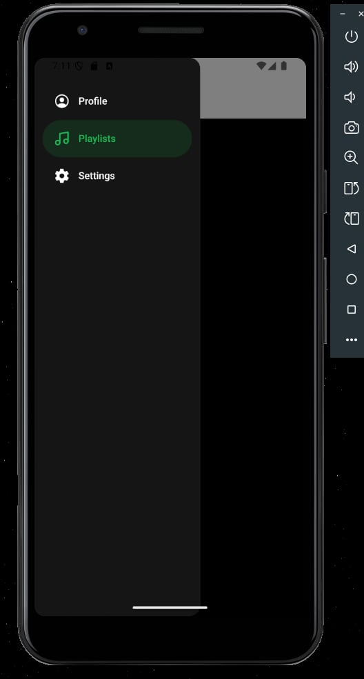
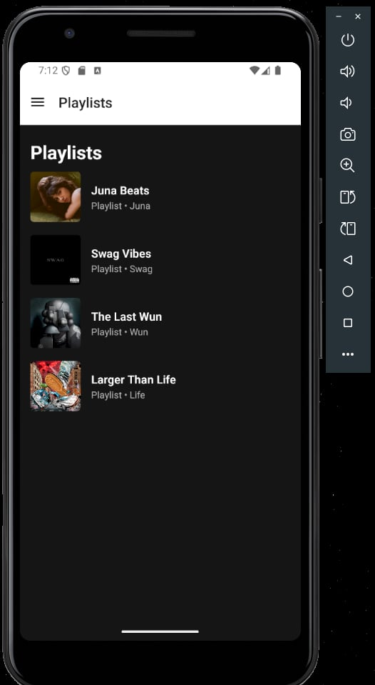
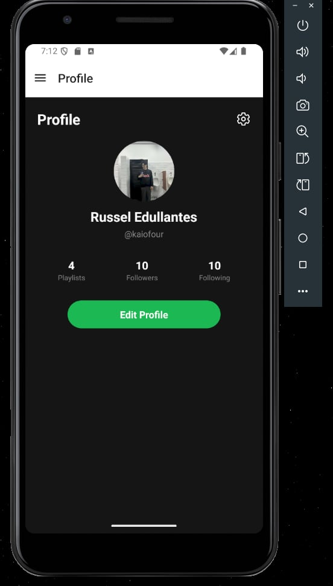
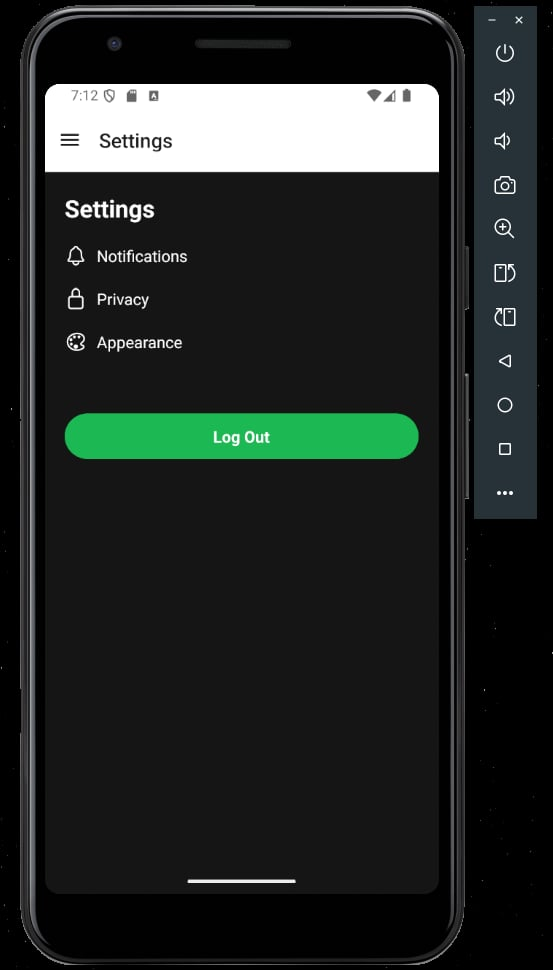
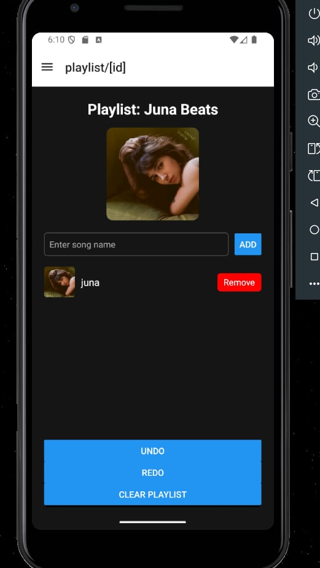
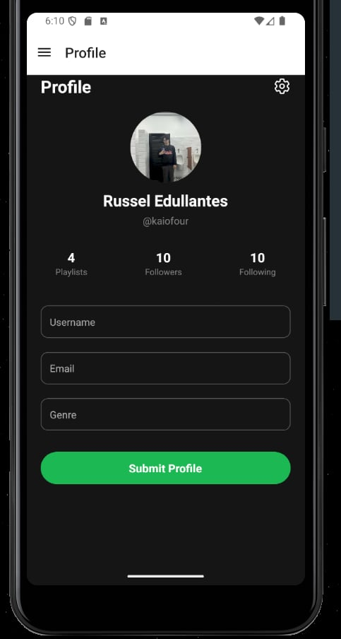
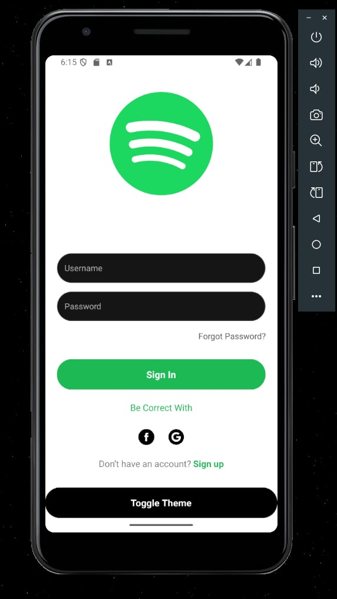

The app uses a stack navigator to manage transitions between the sign-in, sign-up, profile, playlists, and settings screens. A custom drawer navigator styled with Spotify-like icons provides quick access to the Profile, Playlists, and Settings screens, while being hidden on the sign-in and sign-up screens to maintain proper flow








week 4 activity 1

Our state management approach used useReducer for handling complex playlist operations like add, remove, clear, and undo/redo, while AsyncStorage ensured playlists persisted across app restarts. We structured the state into past, present, and future to support time-travel editing, and relied on useState only for lightweight inputs such as the new song field. In short, we kept complex business logic in useReducer and simple UI state in useState, making the app both clean and scalable.

week 4 activity 2


week 5 activity 1

The theme was managed with a Redux store, holding a darkMode state that controlled the app’s colors. UI components used this value to dynamically switch between dark and light backgrounds and text colors. We also added animated transitions for a smoother experience, making the theme toggle feel fluid instead of abrupt.

# Welcome to your Expo app 👋

This is an [Expo](https://expo.dev) project created with [`create-expo-app`](https://www.npmjs.com/package/create-expo-app).

## Get started

1. Install dependencies

   ```bash
   npm install
   ```

2. Start the app

   ```bash
   npx expo start
   ```

In the output, you'll find options to open the app in a

- [development build](https://docs.expo.dev/develop/development-builds/introduction/)
- [Android emulator](https://docs.expo.dev/workflow/android-studio-emulator/)
- [iOS simulator](https://docs.expo.dev/workflow/ios-simulator/)
- [Expo Go](https://expo.dev/go), a limited sandbox for trying out app development with Expo

You can start developing by editing the files inside the **app** directory. This project uses [file-based routing](https://docs.expo.dev/router/introduction).

## Get a fresh project

When you're ready, run:

```bash
npm run reset-project
```

This command will move the starter code to the **app-example** directory and create a blank **app** directory where you can start developing.

## Learn more

To learn more about developing your project with Expo, look at the following resources:

- [Expo documentation](https://docs.expo.dev/): Learn fundamentals, or go into advanced topics with our [guides](https://docs.expo.dev/guides).
- [Learn Expo tutorial](https://docs.expo.dev/tutorial/introduction/): Follow a step-by-step tutorial where you'll create a project that runs on Android, iOS, and the web.

## Join the community

Join our community of developers creating universal apps.

- [Expo on GitHub](https://github.com/expo/expo): View our open source platform and contribute.
- [Discord community](https://chat.expo.dev): Chat with Expo users and ask questions.
